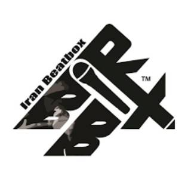
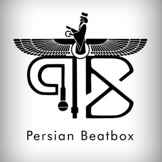
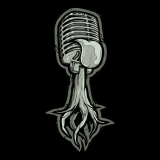

  

# Iran Beatbox

Iran Beatbox Community, the official community of Beatbox Iran, was established with the presence of the best Beatboxers in Iran. Since 2014, it has been active in the field of Beatbox education and organizing exciting Beatbox competitions. It has successfully promoted the art of Beatbox in our country and can be considered as a suitable platform for the growth of Beatbox enthusiasts. Iran Beatbox engages its audience every year through the organization of captivating online and offline battles, as well as conducting Beatbox workshops to further enhance the learning experience. Notable battles include the 2014, 2017, 2019 battles, and the online battle in 2020, featuring popular international Beatbox judges.



##### ایران بیتباکس





ایران بیتباکس کامیونیتی رسمی بیت باکس ایران با حضور بهترین  بیت باکسر های ایران تاسیس گردید و از سال 2014 فعالیت خود را در زمینه آموزش بیت باکس و برگزاری رقابت های جذاب بیت باکس آغاز کرد. و تا اکنون توانسته هنر بیت باکس را به خوبی در کشورمان گسترش دهد و همچنین می‌توان گفت ایران بیتباکس بستری مناسبی برای رشد علاقمندان بیت باکس است. ایران بیتباکس هر ساله با برگزاری بتل های جذاب آنلاین و حضوری و برگزاری کارگاه های آموزشی بیت باکس مخاطبین خود را برای یادگیری بیشتر بیت باکس به اشتیاق می‌آورد. از بتل های برگزار شده می‌توان به بتل 2014، 2017، 2019 و بتل آنلاین 2020 با حضوری داور های بیت باکس محبوب خارج از کشورمان آشاره کرد.



  



  

# Persian Beatbox

Persian Beatbox was formed in 2023 with the aim of improving the quality and elevating the level of Beatbox in Iran by Ali Nazaka, Ali Commando, Mehdi Chaos, and Mohammad Tayko. They organize meetings, challenges, routines, and more, with the intention of bringing together Beatbox enthusiasts and those who love this style of music.

The primary goal of Persian Beatbox is to promote the global music culture and increase awareness of Beatbox among people. It also focuses on talent discovery and development among young individuals across the country.

As the name suggests, Persian Beatbox carries an ancient and deep-rooted authenticity that symbolizes peace, friendship, unity, and solidarity.



##### پرشین بیت باکس





پرشین بیت‌باکس با هدف بهبود کیفیت و ارتقاء سطح  بیت‌باکس در کشور توسط ( علی نازاکا، علی کماندو، مهدی کی آس، محمد تایکو ) در سال ۲۰۲۳ شکل گرفت
که با برگزاری ( میتینگ، چالش، روتین و... ) سعی بر گرد هم آوردی علاقمندان بیت باکس و دوست دارن این سبک از موسیقی دارد

هدف اصلی بنای پرشین بیت‌باکس ترویج فرهنگ موسیقی روز دنیا و شناخت بیشتر مردم نسبت به بیت باکس بوده و استعداد یابی جوانان و نوجوانان در سطح کشور میباشد

پرشین بیت‌باکس همانطور که از نامش پیداست دارای اصالتی کهن و دیرینه است که نماد صلح، دوستی، همبستگی و اتحاد می‌باشد 



  



  

# Beatbox Telegram channel



کانال تلگرام آموزش بیت باکس 





  

